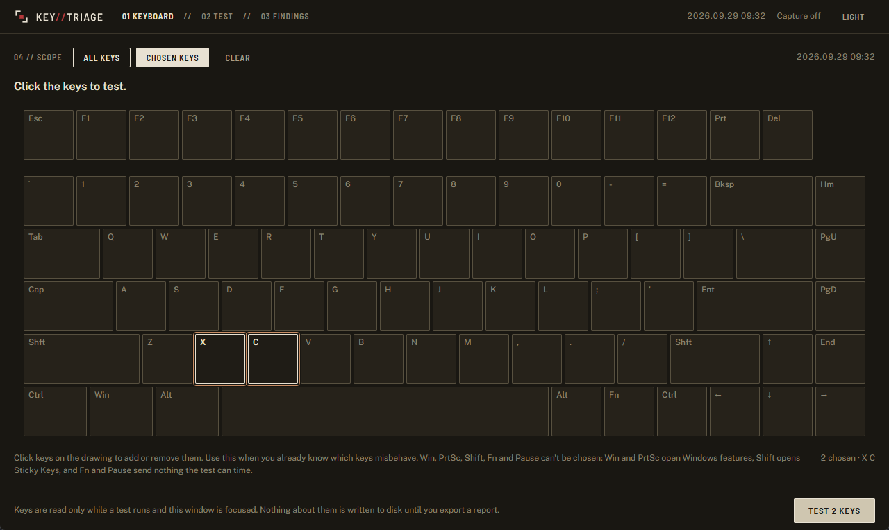
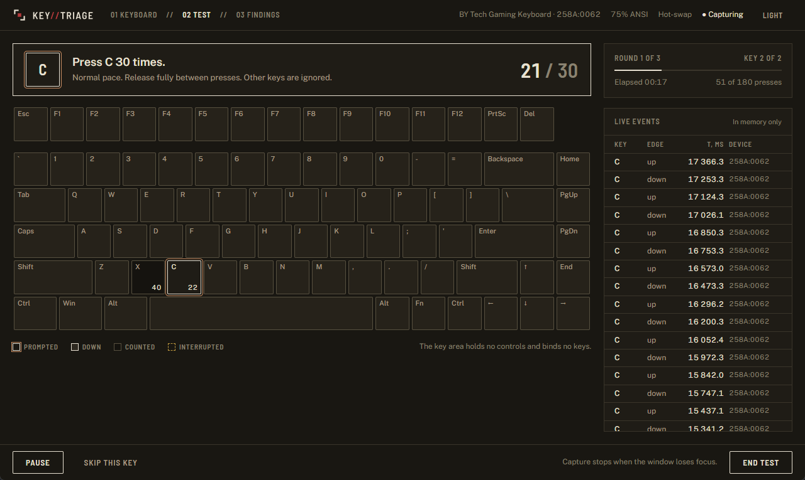
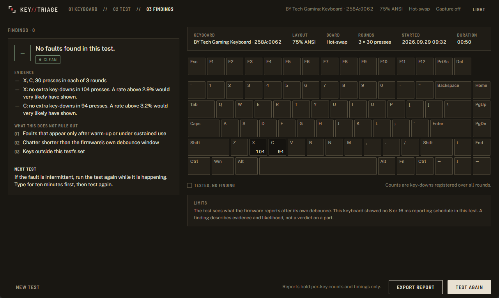
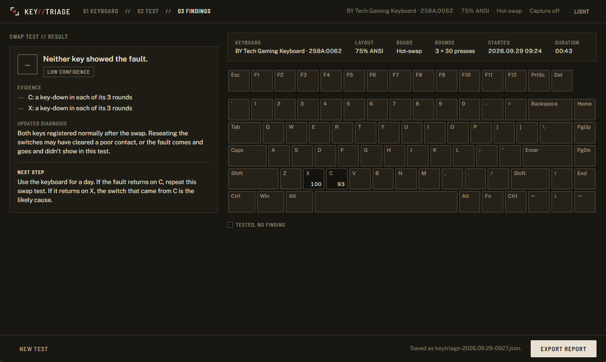

<h1>
  <picture>
    <source media="(prefers-color-scheme: dark)" srcset="docs/brand/lockup-dark.svg">
    
  </picture>
</h1>

**Find out why your keyboard misbehaves, and what to try next.** keytriage tests your keyboard, shows the evidence, ranks the likely causes, and walks you through the test that tells them apart.

A key that double-types, drops presses or sticks could be the switch, the socket or solder joint, the PCB or the firmware. Keyboard testers show that something is wrong, but not what to do about it. So people replace the wrong part, or the whole keyboard.

> **Status:** v0.1.0 for Windows 11 (x64). Windows 10 should work but is untested. See [Install](#install) and [ROADMAP.md](ROADMAP.md).

## What a finding looks like

This is the finding the app shows for a synthetic chatter stream on a hot-swap board.

```text
E   Possible chatter, very high confidence

Evidence
  6 of 30 presses sent an extra key-down (a rate of at least 9.5%)
  The extra key-downs came 5 ms after a release
  The extra presses lasted 5 ms
  Reproduced in 3 of 3 rounds
  None of the 2 other tested keys showed it
  The keyboard's own debounce hides contact bounce shorter than its setting, often 5 ms

Other possible causes
  1. Switch contacts
  2. Hot-swap socket
  3. Firmware debounce

Next test
  Swap the E switch with the G switch and test both keys again.
  If the fault moves to G, the switch is the likely cause.
  If it stays on E, look at the socket or the PCB.

  Blow out the E switch with the key held down, or work contact cleaner
  into it while pressing it many times. Then test E again.

  If the keyboard's firmware lets you, raise its debounce time to 10 ms,
  then 15 ms, and test again.
```

## What it does

- **Tests** for chatter, dead keys and stuck keys on the keyboard you pick, by physical key position.
- **Explains** each finding with its evidence, a confidence level and the other possible causes. It never just says "broken".
- **Isolates** the fault with a guided switch-swap test on hot-swap boards, and gives different next steps for soldered and laptop keyboards.
- **Later:** identifies your keyboard, lists compatible switches with prices, tests rollover and inspects HID.

These are from a real run on 2026.09.29, a hot-swap keyboard with X and C chosen.









## Install

The portable zip is the main download: keytriage runs from its own folder and keeps what it writes there. The installer is the other option. v0.1.0 has only the installer, and the zip comes with the next release.

### Portable

1. Download `keytriage_<version>_x64-portable.zip` and `SHA256SUMS.txt` from the [latest release](https://github.com/hazeliscoding/keytriage/releases/latest) into one folder.
2. Check the zip before you open it. In PowerShell, in that folder, this prints `True`:

   ```powershell
   (Get-FileHash .\keytriage_*_x64-portable.zip).Hash -eq ((Get-Content .\SHA256SUMS.txt) -like '*portable.zip').Split(' ')[0]
   ```

   `certutil -hashfile <file> SHA256` prints the hash to compare with `SHA256SUMS.txt`, and `sha256sum -c --ignore-missing SHA256SUMS.txt` checks it in Git Bash. The release page shows each file's SHA-256 too. With the GitHub CLI, `gh attestation verify <file> --repo hazeliscoding/keytriage` also checks that this repository's release workflow built the file.

3. Extract the zip (right-click it, then **Extract All**), open the `keytriage` folder and run `keytriage.exe`. It keeps WebView2's data in `keytriage-data` beside the exe, so keep the folder somewhere you can write to, such as Downloads or Documents. In a folder it can't write, such as Program Files, it says so and stops. Windows 11 includes WebView2, which draws the window. Where it is missing, keytriage says where to get it.

To remove keytriage, delete its folder. Exported reports stay where you saved them.

### Installer

1. Download `keytriage_<version>_x64-setup.exe` and `SHA256SUMS.txt` into one folder, and check the installer as above, with this line:

   ```powershell
   (Get-FileHash .\keytriage_*_x64-setup.exe).Hash -eq ((Get-Content .\SHA256SUMS.txt) -like '*setup.exe').Split(' ')[0]
   ```

2. Run the installer. It installs for your user only, into `%LOCALAPPDATA%\keytriage`, with no admin prompt. Where WebView2 is missing, the installer runs Microsoft's WebView2 bootstrapper, which downloads the runtime from Microsoft.

To uninstall, open Settings, then Apps, then Installed apps, and uninstall keytriage. Tick **Delete the application data** to also remove the app's WebView2 folder (`%LOCALAPPDATA%\io.github.hazeliscoding.keytriage`) and the registry key that remembers the install folder. Exported reports stay where you saved them.

[PRIVACY.md](PRIVACY.md#6-what-keytriage-leaves-on-your-computer) lists everything each build leaves on your computer.

### Unsigned builds

Neither the zip's `keytriage.exe` nor the installer is code-signed, so Windows can't tell who published them.

- Your browser may warn that the file isn't commonly downloaded. Windows copies the zip's download mark to the files it extracts, so SmartScreen may show "Windows protected your PC" when you start the extracted `keytriage.exe`, as it may for the installer. After checking the hash, choose **More info**, then **Run anyway**.
- Smart App Control, where it is on, blocks unsigned apps it doesn't recognize, and it has no exception for a single app. A build from source is unsigned too, so it doesn't get around this. The setting is in Windows Security, under App & browser control.

## The privacy contract

- **Not a keylogger.** It reads keys only while a test runs and its window is focused. It has no background capture, and CI fails on the Windows APIs that would allow it.
- **No typing saved.** The order of keys stays in memory. Saved reports hold per-key counts and timings only, because an ordered list of keys is the text you typed.
- **No network.** There is no networking code, no telemetry and no auto-updater. Windows' WebView2 runtime, which draws the window, talks to Microsoft on its own; [PRIVACY.md](PRIVACY.md) lists what it does.
- **Open source**, so you can check all of this instead of trusting it.

[PRIVACY.md](PRIVACY.md) maps each promise to the code that keeps it and the check that proves it. Report a broken promise privately, as [SECURITY.md](SECURITY.md) explains.

## Contributing

Each detector is a small Rust module with event-stream fixtures. [CONTRIBUTING.md](CONTRIBUTING.md) explains how to add one, and how to build the zip and the installer from source.

## License

[Apache-2.0](LICENSE). The zip and the installer put the third-party notices in a `licenses` folder beside `keytriage.exe`.
